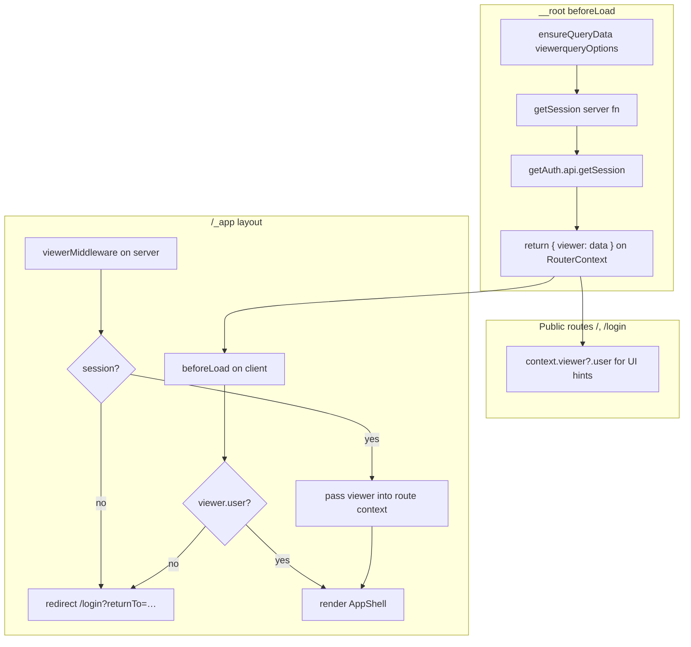

# Voyeur

Browse films, save favorites, and build your watchlist. Built with TanStack Start on Cloudflare Workers (D1 + Hono TMDB proxy).

## Architecture highlights

### TanStack DB — API data and local data as one queryable surface

We use [TanStack DB](https://tanstack.com/db) to mix **live API-backed collections** with **local-only collections** and query them together as if they were tables in one database.

| Collection                       | Source                                  | Role                                                                |
| -------------------------------- | --------------------------------------- | ------------------------------------------------------------------- |
| `moviesCollection`               | TMDB via server proxy                   | Browse results, loaded on demand from the API                       |
| `movieBasicCollection`           | Written by detail fetch (`writeUpsert`) | Cached hero summary (poster, title, overview) per movie id          |
| `movieDetailCollection`          | TMDB via server proxy                   | Full movie detail; seeds `movieBasicCollection` on success          |
| `movieRecommendationsCollection` | TMDB via server proxy                   | Recommendations per source movie; joinable with library collections |
| `favoritesCollection`            | Browser persistence (SQLite / OPFS)     | Per-device favorites                                                |
| `watchlistCollection`            | Browser persistence (SQLite / OPFS)     | Per-device watchlist                                                |

**Movie detail loading** — the detail route uses multiple live queries: browse or recommendations cache for instant hero when coming from a grid, `movieBasicCollection` for return visits, and `movieDetailCollection` for the API fetch. Extra fields (runtime, budget, …) render in `MovieDetailMetadata` with its own loading state. See `src/data-access-layer/tmdb/COLLECTIONS.md` for the full flow.

**Movies from the API** — `moviesCollection` is defined with `queryCollectionOptions` and TanStack Query. It is fully driven by our Hono TMDB proxy: the API key never leaves the server, and fetched pages are stamped with browse context (page, filters, sort) so multiple views can coexist in the same collection.

**Favorites and watchlist locally** — `favoritesCollection` and `watchlistCollection` use `persistedCollectionOptions` with browser SQLite persistence. They are local-only today. TanStack DB supports attaching a sync strategy later so these could follow the signed-in user across devices; we have not wired that up yet.

**Joins in `useLiveQuery`** — Components query across collections with ordinary joins. On the browse screen, movies are left-joined to favorites and watchlist so each row gains `isFavorite` and `isWatchlisted` without ad-hoc merging in React state:

```tsx
useLiveQuery((q) =>
  q
    .from({ movie: moviesCollection })
    .leftJoin({ favorite: favoritesCollection }, ({ movie, favorite }) =>
      eq(movie.id, favorite.movieId),
    )
    .leftJoin({ watchlist: watchlistCollection }, ({ movie, watchlist }) =>
      eq(movie.id, watchlist.movieId),
    )
    .select(({ movie, favorite, watchlist }) => ({
      ...movie,
      isFavorite: not(isUndefined(favorite)),
      isWatchlisted: not(isUndefined(watchlist)),
    })),
);
```

That pattern is the main payoff: remote catalog data and local library state compose in one reactive query instead of separate hooks and manual joins.

Browse loading also uses TanStack DB **query-driven sync** — live-query context (filters, page, sort) flows into the collection `queryFn` so each subset fetch stays aligned with what `useLiveQuery` is asking for. The wiring lives in `src/data-access-layer/tmdb/query-collection.ts` and `movies-browse-subset.ts`; the details matter when extending browse, not when first understanding the app.

All collections are declared in `src/data-access-layer/tmdb/query-collection.ts`.

### TanStack Start, Router context, and auth

**TanStack Start + TanStack Router** carry authentication through the tree:

1. **Root `beforeLoad`** — Every navigation runs `ensureQueryData(viewerqueryOptions)` and merges the result into router context as `viewer` (user + session, or `undefined` when signed out).
2. **`viewerMiddleware` on `/_app`** — On the server, protected layout requests validate the session from cookies before the route renders. Unauthenticated requests redirect to `/login` with `returnTo`.
3. **Client `beforeLoad` on `/_app`** — Catches in-app navigations when the viewer cache is empty after sign-out, without waiting for another server round-trip.

We run our own auth stack (**better-auth** + **Cloudflare D1** + **Drizzle**) instead of a hosted provider like Clerk. Sessions, Google OAuth, and cookie handling stay under our control on the same Worker that proxies TMDB.

**Server-only secrets** — `TMDB_API_KEY` lives in Wrangler env (`.dev.vars`). The client talks to `/api/tmdb/*`; the Hono handler in `src/server/tmdb-routes.ts` attaches the key server-side.

### SSR — capable, but mostly opted out

TanStack Start can server-render routes, and our auth middleware runs on those SSR paths for guarded layouts. In practice the authenticated experience is **client-rendered**:

- `/_app` and `/_app/movies/` set `ssr: false`.
- TanStack DB’s browser collections (SQLite persistence, live queries) do not cooperate cleanly with SSR today.
- The product is **gated behind login**. Crawlers cannot see browse, favorites, or watchlist anyway, so server-rendering that UI would spend Worker CPU on HTML no public user or bot consumes.

Public routes (`/`, `/login`) can still use SSR where it helps; the movie browse shell is intentionally client-only.

### View Transitions

Screen and card transitions use the browser **[View Transitions API](https://developer.mozilla.org/en-US/docs/Web/API/View_Transition_API)** via `withViewTransition` (`src/utils/viewTransition.ts`). Navigation and library toggles wrap DOM updates in `document.startViewTransition` (with `flushSync` so React commits before the animation). Movie posters use matching `viewTransitionName` values between the grid and detail view for shared-element-style motion — native, no animation library required.

### Theming with CSS variables and Tailwind

Themes are built on **CSS custom properties**, not hard-coded colors in components:

- DaisyUI theme plugins in `src/styles.css` define light/dark token sets (`--color-base-100`, `--color-primary`, radii, etc.).
- Additional app tokens (`--ink`, `--sand`, `--surface`, …) layer on top for layout chrome.
- `ThemeProvider` (`src/lib/tanstack/router/theme-provider.tsx`) toggles `light` / `dark` / `system` on `<html>` (`class`, `data-theme`) and persists the choice.
- Tailwind utilities (`bg-background`, `text-primary`, …) resolve through those variables, so a theme switch updates the whole UI consistently.

## Getting started

```bash
pnpm install
cp .dev.vars.example .dev.vars
cp .env.example .env
pnpm db:migrate:local
pnpm dev
```

The dev server runs at [http://localhost:3072](http://localhost:3072).

### Environment variables

There are **three separate env systems** in this stack. They do not overlap — putting a value in the wrong place is the most common production bug.

| Variable | Where to set | Read how | In client bundle? |
| --- | --- | --- | --- |
| `TMDB_API_KEY` | `.dev.vars` / Wrangler secrets | `getWorkerEnv()` on server | No |
| `BETTER_AUTH_SECRET` | `.dev.vars` / Wrangler secrets | `getWorkerEnv()` on server | No |
| `BETTER_AUTH_URL` | `.dev.vars` / Wrangler secrets | `getWorkerEnv()` on server | No |
| `GOOGLE_CLIENT_ID` | `.dev.vars` / Wrangler secrets | `getWorkerEnv()` on server | No |
| `GOOGLE_CLIENT_SECRET` | `.dev.vars` / Wrangler secrets | `getWorkerEnv()` on server | No |
| `BYPASS_AUTH` | `wrangler.jsonc` `vars` or Cloudflare dashboard | `getWorkerEnv()` → `getRuntimeConfig` server fn → root loader | No |
| `VITE_APP_URL` | `.env` or build-time shell env | `import.meta.env` (client); fallback via `getAppUrl()` uses `window.location.origin` in browser | Yes, if set at build |

#### 1. Client bundle — `import.meta.env.VITE_*` (build-time only)

Vite replaces `import.meta.env.VITE_*` when you run `pnpm build`. These values are **baked into `dist/client/`** JavaScript.

- Set in **`.env`** at the project root (or pass inline: `VITE_APP_URL=https://… pnpm build`).
- **Not** read from `.dev.vars` — that file is Wrangler/dev-server only and never touches the client bundle.
- **Not** read from `wrangler.jsonc` `vars` — those are Worker runtime bindings, not Vite build inputs.

Verified locally (`pnpm build` + search `dist/client/`):

```bash
rg "BYPASS|VITE_BYPASS" dist/client          # 0 matches — bypass never lands in client JS
rg "localhost:3072" dist/client/assets/client-env*.js   # default when VITE_APP_URL unset at build
VITE_APP_URL=https://example.test pnpm build
rg "example.test" dist/client/assets/client-env*.js     # value is inlined
```

`import.meta.env` **does work** with TanStack Start + Cloudflare — but only for `VITE_` vars present **during the build step**. Cloudflare Workers Builds must set them under **Build environment variables**, not Worker runtime secrets.

For URLs like auth redirects, this project prefers `getAppUrl()` (`window.location.origin` in the browser) so production does not depend on a build-time URL.

#### 2. Worker runtime — `wrangler.jsonc` `vars` + Wrangler secrets (request-time, server-only)

Plain `vars` in `wrangler.jsonc` deploy as Worker bindings. Secrets go in `.dev.vars` locally and **Wrangler secrets / dashboard** in production. The build copies these into `dist/server/`:

- `dist/server/wrangler.json` — includes `"vars": { "BYPASS_AUTH": "true" }` when set in config
- `dist/server/.dev.vars` — secrets for deploy (never committed)

Read them **per request** via `getWorkerEnv()` inside server functions and middleware — never at module scope ([TanStack Start env guide](https://tanstack.com/start/v0/docs/framework/react/guide/environment-variables)).

Verified locally:

```bash
pnpm build
python3 -c "import json; print(json.load(open('dist/server/wrangler.json'))['vars'])"
# {'BYPASS_AUTH': 'true'}  — runtime config, not in dist/client/

# Remove vars from wrangler.jsonc, rebuild:
python3 -c "import json; print(json.load(open('dist/server/wrangler.json'))['vars'])"
# {}  — gone from deploy manifest; still 0 BYPASS matches in dist/client/
```

Removing `BYPASS_AUTH` from `wrangler.jsonc` removes it from the **deployed Worker binding**. It does **not** remove anything from the client bundle (it was never there). Server code still contains the *lookup logic* for bypass; only the runtime value disappears.

#### 3. Passing runtime server values to the client

Client code cannot read Worker `vars` or secrets directly. Use a server function + loader (what we do for `BYPASS_AUTH`):

1. Server fn reads `getWorkerEnv().BYPASS_AUTH` inside `.handler()`
2. Root `loader` calls `getRuntimeConfig()`
3. Result lands in router context as `authBypassEnabled`

Do **not** use `VITE_BYPASS_AUTH` for production bypass — it is build-time and will not reach client guards reliably on Cloudflare.

`BETTER_AUTH_URL` and `VITE_APP_URL` should match in local development. Configure the same redirect URI in Google Cloud Console (`{BETTER_AUTH_URL}/api/auth/callback/google`).

### Database

Auth tables live in Cloudflare D1 via Drizzle. Apply migrations locally before first run:

```bash
pnpm db:migrate:local
```

## Authentication

Auth follows the viewer pattern from **agentic-json-resume**: a single React Query source of truth for the signed-in user, injected into TanStack Router context, with server middleware guarding protected layouts.

### Stack

- **[better-auth](https://www.better-auth.com/)** — sessions, Google OAuth, cookie handling via `tanstackStartCookies`
- **Cloudflare D1 + Drizzle** — `user`, `session`, `account`, `verification` tables (`src/lib/drizzle/schema/auth-schema.ts`)
- **TanStack Router + React Query** — viewer loaded once at the root, reused everywhere

### Key files

| File                                         | Role                                                      |
| -------------------------------------------- | --------------------------------------------------------- |
| `src/server/create-auth.ts`                  | better-auth instance (Drizzle adapter, Google provider)   |
| `src/lib/auth.ts`                            | `getAuth()` — lazy accessor for the Cloudflare worker env |
| `src/lib/auth.functions.ts`                  | `getSession` server function                              |
| `src/lib/better-auth/client.ts`              | Client-side `authClient`                                  |
| `src/routes/api/auth/$.ts`                   | better-auth HTTP handler (`GET` / `POST`)                 |
| `src/data-access-layer/auth/viewer.ts`       | `viewerqueryOptions`, `useViewer`, `viewerMiddleware`     |
| `src/routes/__root.tsx`                      | Loads viewer into router context on every navigation      |
| `src/routes/_app/route.tsx`                  | Protected layout — server middleware + client redirect    |
| `src/routes/login.tsx`                       | Public sign-in page                                       |
| `src/features/auth/components/LoginCard.tsx` | Google sign-in UI                                         |

### How the viewer flows through the router



1. **Root `beforeLoad`** — Every navigation calls `context.queryClient.ensureQueryData(viewerqueryOptions)`. The query fn calls `getSession()`, which reads cookies on the server via `getRequestHeaders()`. The result is merged into router context as `viewer` (user + session, or `undefined` when signed out).

2. **`viewerqueryOptions` shape** — Returns `{ data: { user, session } | null, error: null }` so callers consistently read `viewer.data` from the query and `context.viewer` from the router (the unwrapped `data` field).

3. **Protected `/_app` routes** — Two guards, same intent:
   - **Server:** `viewerMiddleware` calls `getAuth().api.getSession({ headers: request.headers })` and redirects to `/login` with `returnTo` when there is no session.
   - **Client:** `beforeLoad` redirects when `!serverContext?.isServer && !context.viewer?.user` (covers client-side navigation after sign-out without a full round-trip).

4. **`useViewer()`** — For components inside the protected shell. Uses `useSuspenseQuery(viewerqueryOptions)` and exposes `viewer`, `logoutMutation`. Sign-out calls `authClient.signOut()`, invalidates the viewer query, and redirects to `/login`.

5. **Login** — Public route. `beforeLoad` redirects to `returnTo` (default `/movies`) when `context.viewer?.user` is already set. Google OAuth uses `authClient.signIn.social` with `callbackURL` built from `getAppUrl()` (current origin in the browser; `VITE_APP_URL` for SSR/dev).

### Route access

| Route                                             | Auth required | How viewer is read                      |
| ------------------------------------------------- | ------------- | --------------------------------------- |
| `/`                                               | No            | `useRouteContext({ from: '__root__' })` |
| `/login`                                          | No            | `context.viewer` in `beforeLoad`        |
| `/_app/*` (`/movies`, `/favorites`, `/watchlist`) | Yes           | `useViewer()` in `AppShell`             |

`viewerMiddleware` is attached to `/_app`, not required for public routes, so the landing page and login stay reachable while signed out.

### Design decisions

**React Query as the viewer cache** — The session is fetched through `viewerqueryOptions` instead of ad-hoc `getSession()` calls in each route. Root `ensureQueryData` populates the cache before child routes load; `useViewer` reads the same cache inside the app shell. Invalidation on sign-out keeps UI and router context aligned.

**Dual guard (server middleware + client `beforeLoad`)** — Server middleware protects the initial request and SSR paths. Client `beforeLoad` catches in-app navigations when the viewer query is stale or empty after logout. The client check is gated with `!serverContext?.isServer` to avoid double redirects.

**`getAuth()` instead of a module-level `auth` singleton** — On Cloudflare Workers the Drizzle database binding comes from `env` at request time. `getAuth()` creates the better-auth instance from `cloudflare:workers` env when needed.

**Google-only for now** — Email/password and multi-session plugins are intentionally not enabled. Adding them means owning spam prevention (rate limits, CAPTCHA, disposable-email blocking), email delivery (transactional provider, templates, bounce handling), and password-reset flows — work that Google OAuth sidesteps for a movie-browse app. The Drizzle schema and better-auth setup are ready to extend when that scope is worth taking on.

**Own backend auth instead of Clerk** — Sessions and OAuth run on our Worker + D1. No third-party auth UI or per-MAU billing; we keep the same deployment unit as the TMDB proxy.

**`ssr: false` on the authenticated shell** — See [SSR — capable, but mostly opted out](#ssr--capable-but-mostly-opted-out) above.

**Favorites and watchlist in TanStack DB** — Stored locally in the browser via SQLite/OPFS collections, not yet synced per user in D1. Signing in does not migrate lists across devices; a sync strategy is a natural follow-up.

### Local sign-in checklist

1. Copy `.dev.vars.example` → `.dev.vars` and fill in Google + auth secrets.
2. Copy `.env.example` → `.env` with `VITE_APP_URL=http://localhost:3072`.
3. Run `pnpm db:migrate:local`.
4. Add `http://localhost:3072/api/auth/callback/google` as an authorized redirect URI in Google Cloud Console.
5. Run `pnpm dev` and open `/login`.

## Scripts

```bash
pnpm dev              # Dev server (port 3072)
pnpm build            # Production build
pnpm deploy           # Build + Wrangler deploy
pnpm db:migrate:local # Apply D1 migrations locally
pnpm test             # Vitest
pnpm test:e2e         # Playwright (headless)
pnpm test:e2e:ui      # Playwright UI mode
pnpm lint             # ESLint
```

### E2E tests

There is a small Playwright suite in `e2e/` — not comprehensive, but it covers the main happy path: browse grid → movie detail → recommendations → favorites/watchlist. TMDB responses are mocked via fixtures in `mock/` (no live API calls). `VITE_BYPASS_AUTH=true` is set on the dev server by `playwright.config.ts`; the runtime config server function picks it up so auth guards are skipped in test mode.

## Routing

File-based routes live in `src/routes`. TanStack Router generates `src/routeTree.gen.ts`.

- `__root.tsx` — HTML shell, providers, global viewer preload
- `_app/` — Authenticated layout (movies, favorites, watchlist); `ssr: false`
- `index.tsx` — Public landing page
- `login.tsx` — Sign-in

## Data fetching

| Layer                                                          | Responsibility                                            |
| -------------------------------------------------------------- | --------------------------------------------------------- |
| Hono TMDB proxy (`src/server/tmdb-routes.ts`)                  | Server-side TMDB calls with `TMDB_API_KEY`                |
| TanStack Query (`src/data-access-layer/tmdb/query-options.ts`) | `queryOptions` factories, HTTP fetch helpers, cache keys  |
| TanStack DB (`src/data-access-layer/tmdb/query-collection.ts`) | Collections, live queries, joins with local library state |

Movie browse uses `useLiveQuery` for the grid (movies + favorites + watchlist) and a parallel `useQuery` only where TanStack Query still owns pagination totals. Movie detail routes can prefetch via loaders where SSR is enabled.

### Why `queryOptions` and live queries instead of custom hooks

Custom hooks are kept to a minimum on purpose. Each wrapper adds indirection: you lose the ability to see what a screen is doing without opening three or four files, and subtle bugs creep in when hooks compose other hooks with slightly different assumptions. That pattern scales badly with codegen and agents, which tend to proliferate `useMovies`, `useMovieDetail`, `useFavoriteToggle`, and similar one-offs until the codebase is spaghetti that breaks in non-obvious ways.

The recommended TanStack Query pattern for reusable fetch logic is **`queryOptions`** — a plain object with `queryKey`, `queryFn`, and related options that you pass straight to `useQuery`, `useSuspenseQuery`, or `ensureQueryData`. The viewer session (`viewerqueryOptions` in `src/data-access-layer/auth/viewer.ts`) and TMDB helpers in `src/data-access-layer/tmdb/query-options.ts` follow that shape: one definition, many call sites, no hidden state.

For UI that mixes API catalog data with local library state, **`useLiveQuery`** on TanStack DB collections is the other half. Joins and filters are written inline in the component (or a thin colocated module), so you can read a screen and know exactly which collections and predicates it depends on — instead of tracing through a stack of custom hooks that each re-export a slice of the same data.

Reach for a dedicated hook only when it encapsulates real interaction logic (mutations, form state, multi-step flows), not as a default wrapper around `useQuery`.

## Learn more

- [TanStack Start](https://tanstack.com/start)
- [TanStack Router](https://tanstack.com/router)
- [TanStack DB](https://tanstack.com/db)
- [better-auth](https://www.better-auth.com/docs)
- [View Transitions API](https://developer.mozilla.org/en-US/docs/Web/API/View_Transition_API)
