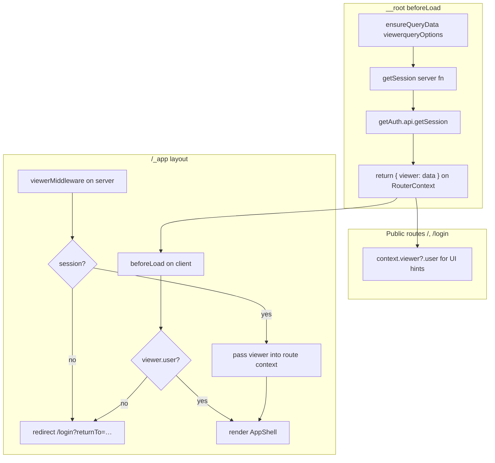

# Voyeur

Browse films, save favorites, and build your watchlist. Built with TanStack Start on Cloudflare Workers (D1 + Hono TMDB proxy).

## Getting started

```bash
pnpm install
cp .dev.vars.example .dev.vars
cp .env.example .env
pnpm db:migrate:local
pnpm dev
```

The dev server runs at [http://localhost:3072](http://localhost:3072).

### Environment variables

| Variable | Where | Purpose |
| --- | --- | --- |
| `TMDB_API_KEY` | `.dev.vars` / Wrangler | TMDB API access (server-only) |
| `BETTER_AUTH_SECRET` | `.dev.vars` / Wrangler | Session signing secret |
| `BETTER_AUTH_URL` | `.dev.vars` / Wrangler | Public app URL (e.g. `http://localhost:3072`) |
| `GOOGLE_CLIENT_ID` | `.dev.vars` / Wrangler | Google OAuth client ID |
| `GOOGLE_CLIENT_SECRET` | `.dev.vars` / Wrangler | Google OAuth client secret |
| `VITE_APP_URL` | `.env` | Client-side app URL for auth redirects |

`BETTER_AUTH_URL` and `VITE_APP_URL` must match in local development. Configure the same redirect URI in the Google Cloud console (`{BETTER_AUTH_URL}/api/auth/callback/google`).

### Database

Auth tables live in Cloudflare D1 via Drizzle. Apply migrations locally before first run:

```bash
pnpm db:migrate:local
```

## Authentication

Auth follows the same viewer pattern used in **agentic-json-resume** (`apps/web/src/data-access-layer/auth/viewer.ts`): a single React Query source of truth for the signed-in user, injected into TanStack Router context, with server middleware guarding protected layouts.

### Stack

- **[better-auth](https://www.better-auth.com/)** — sessions, Google OAuth, cookie handling via `tanstackStartCookies`
- **Cloudflare D1 + Drizzle** — `user`, `session`, `account`, `verification` tables (`src/lib/drizzle/schema/auth-schema.ts`)
- **TanStack Router + React Query** — viewer loaded once at the root, reused everywhere

### Key files

| File | Role |
| --- | --- |
| `src/server/create-auth.ts` | better-auth instance (Drizzle adapter, Google provider) |
| `src/lib/auth.ts` | `getAuth()` — lazy accessor for the Cloudflare worker env |
| `src/lib/auth.functions.ts` | `getSession` server function |
| `src/lib/better-auth/client.ts` | Client-side `authClient` |
| `src/routes/api/auth/$.ts` | better-auth HTTP handler (`GET` / `POST`) |
| `src/data-access-layer/auth/viewer.ts` | `viewerqueryOptions`, `useViewer`, `viewerMiddleware` |
| `src/routes/__root.tsx` | Loads viewer into router context on every navigation |
| `src/routes/_app/route.tsx` | Protected layout — server middleware + client redirect |
| `src/routes/login.tsx` | Public sign-in page |
| `src/features/auth/components/LoginCard.tsx` | Google sign-in UI |

### How the viewer flows through the router



1. **Root `beforeLoad`** — Every navigation calls `context.queryClient.ensureQueryData(viewerqueryOptions)`. The query fn calls `getSession()`, which reads cookies on the server via `getRequestHeaders()`. The result is merged into router context as `viewer` (user + session, or `undefined` when signed out).

2. **`viewerqueryOptions` shape** — Returns `{ data: { user, session } | null, error: null }` so callers consistently read `viewer.data` from the query and `context.viewer` from the router (the unwrapped `data` field).

3. **Protected `/_app` routes** — Two guards, same intent:
   - **Server:** `viewerMiddleware` calls `getAuth().api.getSession({ headers: request.headers })` and redirects to `/login` with `returnTo` when there is no session.
   - **Client:** `beforeLoad` redirects when `!serverContext?.isServer && !context.viewer?.user` (covers client-side navigation after sign-out without a full round-trip).

4. **`useViewer()`** — For components inside the protected shell. Uses `useSuspenseQuery(viewerqueryOptions)` and exposes `viewer`, `logoutMutation`. Sign-out calls `authClient.signOut()`, invalidates the viewer query, and redirects to `/login`.

5. **Login** — Public route. `beforeLoad` redirects to `returnTo` (default `/movies`) when `context.viewer?.user` is already set. Google OAuth uses `authClient.signIn.social` with `callbackURL` built from `VITE_APP_URL`.

### Route access

| Route | Auth required | How viewer is read |
| --- | --- | --- |
| `/` | No | `useRouteContext({ from: '__root__' })` |
| `/login` | No | `context.viewer` in `beforeLoad` |
| `/_app/*` (`/movies`, `/favorites`, `/watchlist`) | Yes | `useViewer()` in `AppShell` |

`viewerMiddleware` is attached only to `/_app`, not `__root`, so the landing page and login stay public.

### Design decisions

**React Query as the viewer cache** — The session is fetched through `viewerqueryOptions` instead of ad-hoc `getSession()` calls in each route. Root `ensureQueryData` populates the cache before child routes load; `useViewer` reads the same cache inside the app shell. Invalidation on sign-out keeps UI and router context aligned.

**Dual guard (server middleware + client `beforeLoad`)** — Server middleware protects the initial request and SSR paths. Client `beforeLoad` catches in-app navigations when the viewer query is stale or empty after logout. The client check is gated with `!serverContext?.isServer` to avoid double redirects.

**`getAuth()` instead of a module-level `auth` singleton** — On Cloudflare Workers the Drizzle database binding comes from `env` at request time. `getAuth()` creates the better-auth instance from `cloudflare:workers` env when needed.

**Google-only for now** — Email/password and multi-session plugins are not enabled. The schema and better-auth setup are ready to extend.

**`ssr: false` on `/_app`** — The authenticated shell is client-rendered. TMDB browsing still uses server loaders/proxies where needed; auth guarding does not depend on SSR for the layout.

**`/login` instead of `/auth`** — Matches Voyeur’s route naming; behavior is the same as the reference app’s `/auth` route.

**Favorites and watchlist stay in `localStorage`** — Not yet persisted per user in D1. Signing in does not migrate lists; that is a follow-up.

### Local sign-in checklist

1. Copy `.dev.vars.example` → `.dev.vars` and fill in Google + auth secrets.
2. Copy `.env.example` → `.env` with `VITE_APP_URL=http://localhost:3072`.
3. Run `pnpm db:migrate:local`.
4. Add `http://localhost:3072/api/auth/callback/google` as an authorized redirect URI in Google Cloud Console.
5. Run `pnpm dev` and open `/login`.

## Scripts

```bash
pnpm dev              # Dev server (port 3072)
pnpm build            # Production build
pnpm deploy           # Build + Wrangler deploy
pnpm db:migrate:local # Apply D1 migrations locally
pnpm test             # Vitest
pnpm lint             # ESLint
```

## Routing

File-based routes live in `src/routes`. TanStack Router generates `src/routeTree.gen.ts`.

- `__root.tsx` — HTML shell, providers, global viewer preload
- `_app/` — Authenticated layout (movies, favorites, watchlist)
- `index.tsx` — Public landing page
- `login.tsx` — Sign-in

## Data fetching

TMDB data is fetched through a Hono proxy (`src/data-access-layer/tmdb/`) so the API key never reaches the client. Movie list routes use TanStack Query with `keepPreviousData` for pagination; movie detail routes use loaders with `fetchQuery` for SSR-friendly prefetch.

## Learn more

- [TanStack Start](https://tanstack.com/start)
- [TanStack Router](https://tanstack.com/router)
- [better-auth](https://www.better-auth.com/docs)
